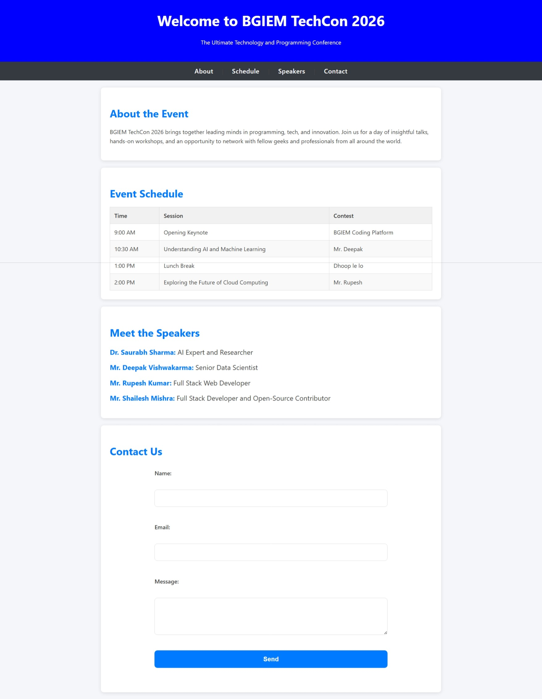

# BGIEM TechCon 2026 - Official Website

Welcome to the official repository for the **BGIEM TechCon 2026** event. This is a single-page website designed for a technology and programming conference.

## 🚀 Overview
BGIEM TechCon 2026 brings together leading minds in programming, tech, and innovation. This project is built using a clean architecture with **Internal CSS** for easy portability and fast rendering.

## ✨ Features
* **Modern UI:** Clean and responsive design using a professional Blue and Dark Gray theme.
* **Event Schedule:** A detailed session table including Opening Keynote, AI/ML workshops, and Cloud Computing sessions.
* **Speakers:** Profiles of industry experts like Dr. Saurabh Sharma and Mr. Deepak Vishwakarma.
* **Contact Form:** Integrated user feedback section for inquiries.

## 🛠️ Built With
* **HTML5:** For core structure.
* **CSS3:** Internal styling within the `<style>` tag.

## 📸 Project Preview

